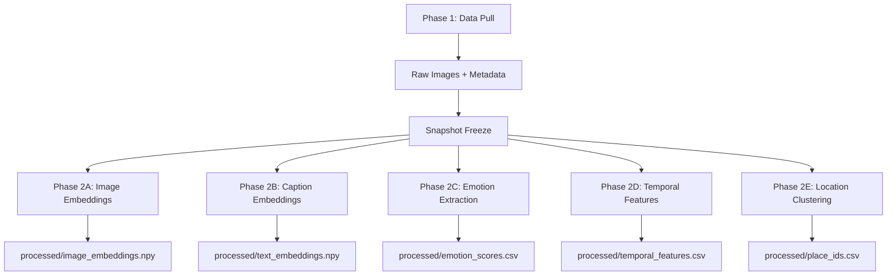

# Pipeline Overview

The DREAMS pipeline consists of two main phases: data acquisition and feature extraction.

## Architecture

## Phase Summary

| Phase | Input | Output | Model |
|-------|-------|--------|-------|
| **1** | D1 Database | Raw images + metadata | - |
| **2A** | Images | 512-dim embeddings | CLIP ViT-B/32 |
| **2B** | Captions | 384-dim embeddings | Sentence-BERT |
| **2C** | Captions | Valence/arousal + emotions | DistilRoBERTa |
| **2D** | Timestamps | Circadian encoding | - |
| **2E** | GPS coords | Place IDs | DBSCAN |

## Data Flow

1. **Pull**: Download images and metadata from Cloudflare D1
2. **Freeze**: Create immutable snapshot for experiment reproducibility
3. **Extract**: Run feature extraction pipelines on frozen data
4. **Analyze**: Use extracted features for research analysis
